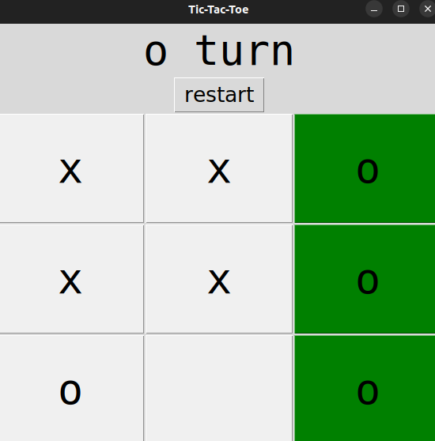
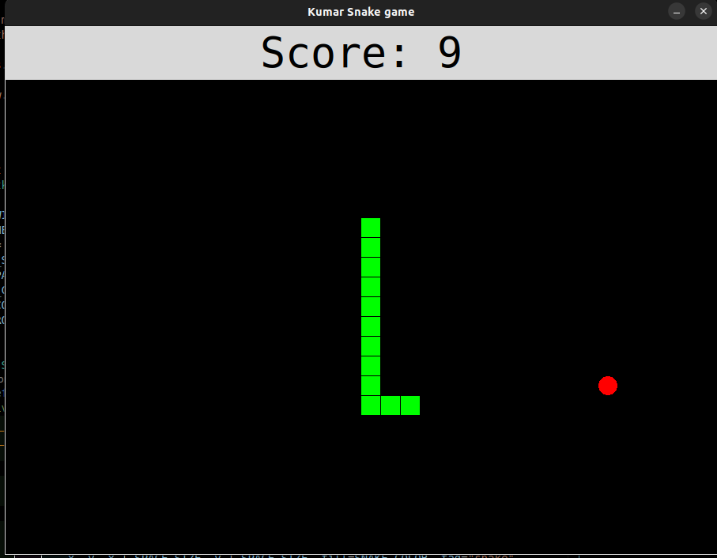
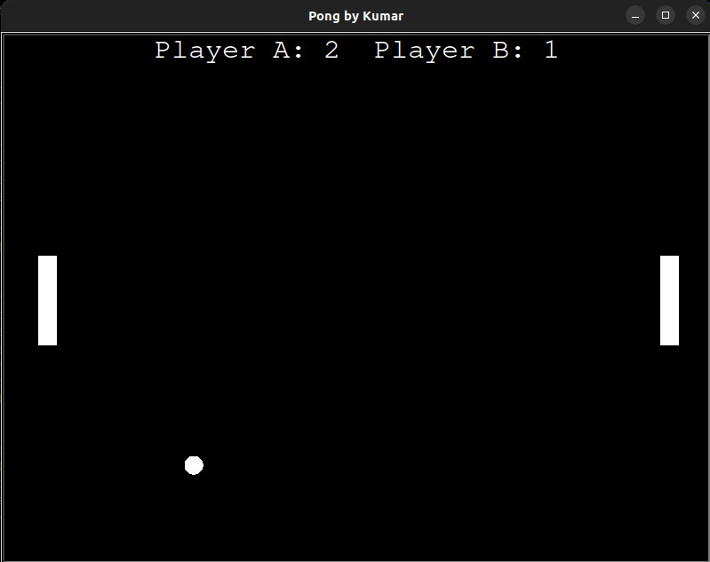
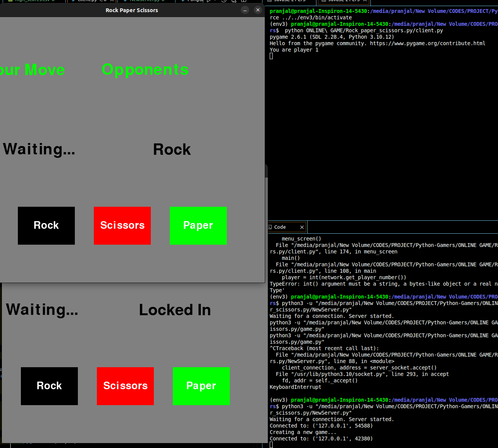

Here's a professional, **well-structured**, and **enhanced** `README.md` file for your **Python Games** repository, including sections for images, installation, usage, and contribution guidelines.  

---

# 🎮 Python Games Collection 🚀  

A collection of fun and interactive **Python-based** games, including **classic arcade and board games**, designed for both learning and entertainment. Whether you're looking to challenge your reflexes, test your strategy skills, or improve your typing speed, this repo has something for everyone!  

---

## 📌 Features  
✔ **Tetris** – Play the classic falling blocks puzzle game.  
✔ **Snake Game** – Eat, grow, and survive in this retro-style game.  
✔ **Pong** – The legendary two-player paddle game.  
✔ **Tic-Tac-Toe** – Challenge a friend or play against AI.  
✔ **Four in a Row** – A strategy game where you connect four pieces.  
✔ **Typing Speed Calculator** – Test and improve your typing skills.  
✔ **Kaun Banega Crorepati (KBC)** – A quiz game inspired by the popular TV show.  

---

## 📷 Screenshots  

Here’s a preview of some of the games included in this collection:  

### 🎲 **Tic-Tac-Toe**  
  

### 🐍 **Snake Game**  
  

### 🎮 **Pong**  g
 

### ⌨ **Online Game**  

---

## 🚀 Installation  

### 📥 Clone the Repository  
```sh
git clone https://github.com/pranjalkumar09/Python-Games.git
cd Python-Games
```

### 📦 Install Dependencies  
Ensure you have **Python 3.x** installed. Then, install the required dependencies:  
```sh
pip install -r requirements.txt
```

---

## 🕹 Running the Games  

Each game can be executed separately. Example:  

### ▶ Run **Snake Game**  
```sh
python src/snake_game.py
```

### ▶ Run **Tic-Tac-Toe**  
```sh
python src/tic_tac_toe.py
```

### ▶ Run **Typing Speed Calculator**  
```sh
python src/TYPING_SPEED_CALCULATOR/main.py
```

---

## 📜 Project Structure  

```
📂 Python-Games
│-- 📂 src/
│   │-- 📂 ONLINE_GAME/                 # Online multiplayer games
│   │-- 📂 TERTIS_GAME/                  # Tetris game implementation
│   │-- 📂 TYPING_SPEED_CALCULATOR/      # Typing speed test
│   │-- 📄 four_in_row_GAME.py           # Four in a row strategy game
│   │-- 📄 KBC_kaun_banega_carorepati.py  # Quiz game
│   │-- 📄 PongGAME.py                   # Classic Pong game
│   │-- 📄 snake_game.py                  # Retro Snake game
│   │-- 📄 tic_tac_toe.py                 # Tic-Tac-Toe game
│-- 📂 static/                            # Game assets, images, sounds
│-- 📄 deployment.yaml                     # Deployment configuration
│-- 📄 Dockerfile                          # Containerization setup
│-- 📄 LICENSE                             # Open-source license
│-- 📄 README.md                           # Documentation
│-- 📄 requirements.txt                     # Dependencies list
│-- 📄 service.yaml                         # Service configuration
```

---

## 🤝 Contributing  

🔹 Contributions are welcome! If you’d like to improve a game or add new features, follow these steps:  
1. **Fork the repository**  
2. **Create a new branch** (`feature/new-game`)  
3. **Make changes and commit**  
4. **Push to your fork**  
5. **Submit a pull request**  

---

## 📜 License  

This project is licensed under the **MIT License**. See [`LICENSE`](LICENSE) for details.  

---
